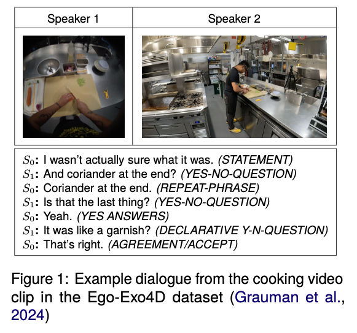

# PAIR: A Pilot Dataset for Dual Perspective-based Video-Grounded Dialogue and Reconciliation

This repository contains the PAIR dialogue corpus for studying collaborative reconciliation under perceptual asymmetry (dual ego/exo video perspectives).

`paper.pdf` is available in this local project copy, but it is not intended to be included in the online repository release.



## Links

- GitHub mirror: https://github.com/lewiswatson55/PAIR_Corpus
- Hugging Face dataset mirror: https://huggingface.co/datasets/lewiswatson/PAIR_Corpus/
- Paper (public link): Coming soon (the link will be added here once the paper is public)

## Dataset at a glance

- 5 video scenarios (from Ego-Exo4D clips), each collected with 3 independent participant pairs
- 15 dialogues total
- 2,676 utterances in the released transcripts
- 42-label dialogue act schema (Stolcke et al., 2000); 38 labels occur in this release
- Transcripts are manually verified and include speaker labels plus dialogue-act tags

## Repository structure

- `JSON Version/pair_dataset.json`
  - Full corpus in one JSON file
- `CSV Version/<clip_id>/Dialogue_01.csv` ... `Dialogue_03.csv`
  - Per-dialogue CSV exports for each clip ID
- `Analysis/PAIR_Corpus_TBR_Analysis.csv`
  - Turn-balance and dialogue-structure analysis table used in the paper
- `PAIR_FIGURE.png`
  - Figure used in this README

## Data format

### JSON format

`pair_dataset.json` is a dictionary:

- Key: clip/scenario ID (e.g., `upenn_0630_Cooking_4_3`, `iiith_soccer_001_4`)
- Value: list of 3 dialogues for that clip
- Each dialogue: list of utterance objects with:
  - `Speaker`
  - `Text`
  - `Tag`

### CSV format

Each CSV file has the same schema:

- `Speaker`
- `Text`
- `Tag`

## Source videos and redistribution

PAIR is derived from ego/exo clips in Ego-Exo4D. This repository does **not** redistribute the original video stimuli. Only anonymised transcript/annotation data are included here.

## Citation

Please cite PAIR as:

Watson, L., Strathearn, C., Mitchell, K., & Yu, Y. (2026, May 11-16). *PAIR: A Pilot Dataset for Dual Perspective-based Video-Grounded Dialogue and Reconciliation*. **LREC 2026: Language Resources and Evaluation Conference**, Palma, Mallorca. https://lrec2026.info/

```bibtex
@inproceedings{watson2026pair,
  title = {PAIR: A Pilot Dataset for Dual Perspective-based Video-Grounded Dialogue and Reconciliation},
  author = {Watson, Lewis and Strathearn, Carl and Mitchell, Kenny and Yu, Yanchao},
  booktitle = {LREC 2026: Language Resources and Evaluation Conference},
  year = {2026},
  month = {May},
  address = {Palma, Mallorca},
  publisher = {European Language Resources Association (ELRA)},
  url = {https://lrec2026.info/}
}
```

Citation metadata will be updated when the final publication page and DOI are available.
